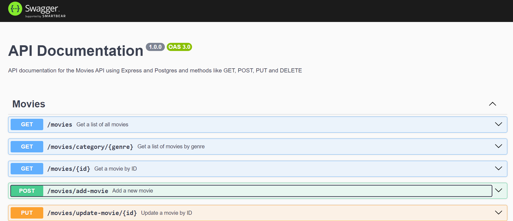

# Movie API

This is a RESTful API for managing a movie database, developed with Node.js, Express.js, JavaScript, PostgreSQL, and documented with Swagger. It uses Nodemon for development and Zod for data validation.

## Technologies Used

- **Node.js**: JavaScript runtime environment.
- **Express.js**: Web framework for building the API.
- **JavaScript**: Main programming language.
- **Nodemon**: Tool for automatically restarting the server during development.
- **Zod**: Library for schema validation.
- **PostgreSQL**: Relational database management system.
- **Morgan**: HTTP request logger middleware.
- **Swagger**: Tool for API documentation.

## Prerequisites

- Node.js and npm installed.
- PostgreSQL configured and running.

## Installation

1. Clone the repository:
   ```bash
   git clone https://github.com/your_username/movie-api.git
Navigate to the project directory:

cd movie-api
Install dependencies:

### npm install
Set up environment variables:
Create a .env file at the root of the project with the following variables:

**DB_HOST=your_database_host**
**DB_USER=your_database_user**
**DB_PASSWORD=your_database_password**
**DB_NAME=your_database_name**
**DB_PORT=your_database_port**

Database Setup

Install PostgreSQL: If PostgreSQL is not installed, download and install it from the official PostgreSQL website.

### Create a Database:

Open your terminal and access the PostgreSQL command line interface (psql) or use a graphical tool like pgAdmin.
Create a new database with the command:
sql

CREATE DATABASE movie_api;

Create Tables:

Connect to the newly created database:

\c movie_api

Create the necessary tables. For example:

CREATE TABLE movies (
  id SERIAL PRIMARY KEY,
  title VARCHAR(255) NOT NULL,
  director VARCHAR(255),
  release_year INTEGER,
  genre VARCHAR(255)[],
  rating DOUBLE PRECISION
);

### Configure Database Connection:

Use the pg library to connect to the PostgreSQL database. Here's an example configuration:

const { Pool } = require('pg');
const pool = new Pool({
  host: process.env.DB_HOST,
  user: process.env.DB_USER,
  password: process.env.DB_PASSWORD,
  database: process.env.DB_NAME,
  port: process.env.DB_PORT
});

Usage
Development
To start the server in development mode with automatic reloads:

npm run dev

Production
To start the server in production mode:


npm run start

API Routes
The API provides the following CRUD methods:

Get all movies: GET /movies

Get movies by genre: GET /movies/:genre

Get a movie by ID: GET /movies/movie/:id

Add a new movie: POST /movies/add-movie

Update a movie by ID: PUT /movies/update-movie/:id

## Documentation

API documentation is available at /api-docs using Swagger. Visit http://localhost:YOUR_PORT/api-docs to view the interactive documentation and test the routes.

